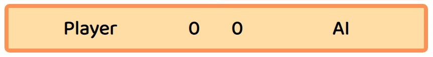

# ROCK PAPER SCISSORS LIZARD SPOCK

Play "ROCK PAPER SCISSORS LIZARD SPOCK" with a truly random opponent instead of a predictable person. It can be used to break a tie, resolve a dilemma, or kill time in a fun way. This game is also designed to never result in a tie.

This is a popular expansion of the classical "Rock Paper Scissors". It adds "Lizard" and "Spock" to the standard three choices. This variant was mentioned in a 2005 article in The Times of London and was later the subject of an episode of the American sitcom [The Big Bang Theory](https://www.warnerbros.com/tv/big-bang-theory) in 2008 (as Rock-Paper-Scissors-Lizard-Spock).

This game can be played by adults and children alike. The users of "ROCK PAPER SCISSORS LIZARD SPOCK" can learn the rules, practice the game and enjoy playing it. 

## Features

### Existing Features

- ### Header
    - The header is located on top of the page. The font used is spurless and jovial in order to create the atmosphere of a friendly game. The icons used are meant to offer a more immersive experience for the player. 
    - The main purpose of the header is to inform the player what is the game they are playing.

- ### Game Start Section
    - This section is only displayed to the user when a new game starts and it presents the opportunity of introducing a name the user wants to use during the game.
    - The default username is "Player" but it can be easily changed directly from the keyboard as the text in the input field is selected from the start, and the cursor is focused on the input field as well.
    - The "Start" button is interactive and starts the game. The same effect can be achieved by pressing "Enter" or "NumEnter" while the cursor is still in the input field.  

- ### Player Choice Buttons 
    - A series of buttons presenting the player with a choice of options from which the player can play ROCK, PAPER, SCISSORS, LIZARD or SPOCK.
    - The buttons are colored in unique colors so the player can easily distinguish between the choices presented to them. The colors are also relevant to the symbol they represent. ROCK - warm gray, PAPER - orange, SCISSORS - red, LIZARD - green, SPOCK - blue.
    - This section presents interactive buttons which allow the player to make a choice and play the game.

- ### Auxiliary Buttons 
    - A series of interactive buttons meant to help the player. 
    - The "New Game" button has the purpose to offer the player the opportunity to start the new game without reloading the page.
    - The "Game Rules" button allows the players to become familiar with the game rules at any moment during the game.

- ### Result Area
    - Two rectangular areas where the relevant icons of the choices both the player and the AI have made, are displayed.
    - Presents the player with the opportunity to view the gesture they chose by displaying the icon present on the button the player clicked in the section bordered by a blue frame.
    - The area with a red frame displays the icon that represents a random choice made by the AI. 

- ### Score Area 
    - An area where the player can keep track of the score throughout the game.
    - Displays the player name and the AI acronym for the opponent name. 
    - In the center of the area, the score is displayed and it is updated every time the player decides to play a choice or restart the game.

- ### Game Rules Section
    - This section is visible only after clicking on the "Game Rules" button and can be closed by pressing on one of the "Close Rules" buttons. Here the player can get familiarized with the rules of the game. 
    - The Game Rules section is not completely opaque in order to offer the player a sense of security that the game has not been altered after consulting the rules.

### Features Left To Implement

- In the future I would like to expand the game to include multiple levels of difficulty and a limited number of turns or an option for the player to finish the game.

## Testing

- I tested playing this game in different browsers: Edge, Chrome, Safari, Firefox, Opera.
- I confirmed the game results are always the right ones.
- I confirmed the website content is readable and easy to understand.
- I confirmed the fonts and colors chosen are easy to read and accessible by running the app through "Lighthouse" in devtools.

- I confirmed this project is responsive and functions on all standard screen sizes using devtools device toolbar.

### Bugs

- None

### Validator testing

- ### HTML
    - No errors were returned when passing the code through W3C HTML Validator.
- ### CSS 
    - No errors were returned when passing the code through W3C CSS Validator (Jigsaw).
- ### JavaScript
    - No errors were returned when passing the code through JSHint JavaScript Validator.

## Deployment

- The site was deployed on GitHub. The steps to deploy are the following:
    - In the GitHub repository, navigate to the Settings tab
    - From the vertical side bar menu, select Pages
    - from the source selection drop-down menu, select "main"
    - after the "main" branch has been selected, the link to the website will be provided.

The live link to the website - [Rock Paper Scissors Lizard Spock](https://samsswi.github.io/Rock-Paper-Scissors-Lizard-Spock/)

## Credits

### Content

- The rules of the game are extracted from: [Instructables](https://www.instructables.com/How-to-Play-Rock-Paper-Scissors-Lizard-Spock/).
- The code for the DomContentLoaded event and the for...of loop condition, are taken from [Code Institute Love Maths](https://github.com/Code-Institute-Solutions/love-maths-2.0-sourcecode/blob/master/05-tidying-up/01-a-few-last-things/assets/js/script.js) project.
- The focus() and select() methods in the selectNameInput() function are taken from [developer.mozilla.org](https://developer.mozilla.org/en-US/docs/Web/API/HTMLInputElement/select).
- The 'keydown' event listener syntax and the if condition are taken from [Code Institute Love Maths](https://github.com/Code-Institute-Solutions/love-maths-2.0-sourcecode/blob/master/05-tidying-up/01-a-few-last-things/assets/js/script.js) project.

